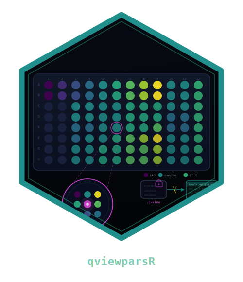

```{r setup, include = FALSE}
knitr::opts_chunk$set(
  collapse = TRUE,
  comment  = "#>",
  eval     = FALSE,
  fig.align = "center",
  fig.width = 7, fig.height = 4.5,
  dpi = 96
)
library(qviewparsR)
```

```{=html}
<style>
:root { --qv-fg:#212121; --qv-bg:#fafafa; --qv-line:#e0e0e0;
        --qv-mute:#666; --qv-card:#fff; --qv-cap:#f0f0f0; }
body  { font-family: system-ui,-apple-system,BlinkMacSystemFont,"Segoe UI",
        Roboto,"Helvetica Neue",Arial,sans-serif;
        color: var(--qv-fg); background: var(--qv-bg);
        line-height: 1.5; max-width: 760px; margin: 2rem auto;
        padding: 0 1.25rem; }
h1, h2, h3, h4 { letter-spacing: .02em; font-weight: 600; }
h1 { font-size: 1.65rem; border-bottom: 1px solid var(--qv-line);
     padding-bottom: .25rem; }
h2 { font-size: 1.25rem; margin-top: 1.6rem; }
h3 { font-size: 1.05rem; margin-top: 1.2rem; color: var(--qv-mute); }
a, a:visited { color: var(--qv-fg); text-underline-offset: .18em; }
a:hover { color: #000; text-decoration-thickness: 2px; }
code, pre, kbd { font-family: "SF Mono",Consolas,"Liberation Mono",Menlo,monospace; }
code { background: var(--qv-card); border: 1px solid var(--qv-line);
       padding: 0 .25rem; border-radius: 3px; }
pre  { background: var(--qv-card); border: 1px solid var(--qv-line);
       padding: .9rem 1rem; border-radius: .25rem; overflow-x: auto; }
pre code { border: 0; padding: 0; background: transparent; }
table { border-collapse: collapse; margin: 0.6rem 0; }
table th { border-bottom: 1px solid var(--qv-fg); text-align: left;
           padding: .35rem .65rem; }
table td { padding: .35rem .65rem; border-bottom: 1px solid var(--qv-line); }
blockquote { border-left: 3px solid var(--qv-fg);
             padding: .25rem .9rem; color: var(--qv-fg);
             background: var(--qv-card); margin: 1rem 0; }
.qv-hero { display:flex; align-items:center; gap:1rem;
           padding-bottom:1rem; border-bottom:1px solid var(--qv-line); }
.qv-hero img { height: 96px; width: auto; }
.qv-hero h1  { border: 0; padding: 0; margin: 0 0 .25rem 0; font-size: 1.6rem; }
.qv-hero p   { margin: 0; color: var(--qv-mute); }
hr { border: 0; border-top: 1px solid var(--qv-line); margin: 1.5rem 0; }
</style>
```

::: qv-hero



::: {.qv-meta}
# qviewparsR
Pure-R parser for `.Q-View` multiplex ELISA project files.
:::

:::

A `.Q-View` file is a single-file binary container that bundles a
plain-text manifest, an embedded H2 SQL database with project
metadata / analyte panel / sample assignments / replicate pixel
intensities (and -- when generated -- a fully rendered CSV report
stored as a CLOB), and one or more LOB segments holding the raw
chemiluminescent plate images.

`qviewparsR` extracts everything except the raw images and returns it
as tidy tibbles. There is no Java runtime, no H2 database driver, no
compiled code -- all logic is pure R.

## Installation

`qviewparsR` is **pure R** -- no compiled code, no Java runtime, no H2
database driver, and no system libraries -- so it installs identically on
**Windows, macOS, and Linux**. The only hard prerequisite is
**R >= 4.1.0**.

From CRAN (once released):

```r
install.packages("qviewparsR")
```

Development version from GitHub:

```r
# install.packages("pak")
pak::pak("CTTIR/qviewparsR")
```

Platform notes: on **Windows** no *Rtools* is required (the package
compiles nothing and its CRAN dependencies arrive as binaries); on
**macOS** nothing beyond R is needed; on **Linux** the package itself is
pure R, but a few dependencies (`dplyr`, `readr`, `tidyr`, `openxlsx2`)
contain C++ and build from source unless you use a binary repository
(for example the Posit Public Package Manager or r2u), which avoids
needing a compiler.

The package depends on a small tidyverse-aligned core
(`cli`, `dplyr`, `lifecycle`, `openxlsx2`, `readr`, `rlang`, `tibble`,
`tidyr`). Plotting requires `ggplot2`; the publication overview adds
`patchwork`; the Shiny front-end adds `shiny`, `bslib`, `DT`, `withr`.

## A complete walk-through

```r
library(qviewparsR)

qv <- read_qview("path/to/plate.Q-View")
qv                          # one-screen summary

qv$analytes                 # spot_number, analyte, unit, lod, lloq, uloq
qv$well_groups              # one row per sample / calibrator / control
qv$pixel_intensities        # long-format replicate readings
qv$summary_statistics       # per-group mean / std-dev / CV rows
qv$plate_layout             # one row per plate well

summary(qv)                 # mean / SD / CV per well type x analyte
```

`read_qview()` always returns a list of class `qview` with eleven
slots described in `?read_qview`. Empty slots are zero-row tibbles
rather than `NULL`, so downstream code can rely on shape stability.

## Reading flat report exports

Sometimes only the flat report Q-View writes next to the binary
container is kept -- the `..._auto_report` or
`..._auto_all-parameters_report` file, as `.csv` or `.xlsx`. When the
original `.Q-View` project is unavailable, `read_qview_report()` parses
that export and returns the same `qview` object `read_qview()` builds:

```r
rep <- read_qview_report("path/to/plate_auto_report.csv")
is_qview(rep)               # TRUE -- same class as read_qview()
rep$concentrations          # long-format, with an out-of-range `flag`
```

It differs from `read_qview()` in two deliberate ways: it captures the
plain `"Reduced Concentration"` point estimate (one row per sample, with
`statistic == "reduced"`), and it preserves out-of-range cells instead
of dropping them -- a `"< 52.50"` cell becomes `concentration = 52.50`
with `flag = "<"` (`">"` for the upper bound, `"incalculable"` for
`Incalculable`), so limit-of-quantification information survives import.

## The naming convention

The producing software rewrites identifiers from the original
well-assignment template before storing them. The mapping is
systematic and reversible:

| Template value                  | Stored as                          |
|---------------------------------|------------------------------------|
| `Cal 1` ... `Cal N`             | `ICal 1` ... `ICal N`              |
| `Low`                           | `GLow`                             |
| `High`                          | `HHigh`                            |
| `FD24277364`, `1211498458`, ... | `NFD24277364`, `N1211498458`, ...  |

`strip_qview_prefix()` reverses the rewrite. Pass `strip_prefix = TRUE`
to `read_qview()` to apply it across every sample-id column at once:

```r
qv <- read_qview("path/to/plate.Q-View", strip_prefix = TRUE)
unique(qv$well_groups$sample_id)

strip_qview_prefix(c("ICal 1", "GLow", "HHigh", "NFD24277364"))
#> [1] "Cal 1"      "Low"        "High"       "FD24277364"
```

## Coercion and tidy-data idioms

`as_tibble()` returns the long-format `pixel_intensities` table -- the
primary tabular payload -- so a parsed object drops straight into a
dplyr / ggplot2 pipeline:

```r
library(dplyr)

qv |>
  as_tibble() |>
  filter(replicate == 1L) |>
  group_by(analyte, unit) |>
  summarise(median_pi = median(pixel_intensity, na.rm = TRUE),
            .groups = "drop")
```

## Visualisation

The `plot.qview()` method offers three quick-look views, all coloured
on the same viridis ramp the Shiny app uses:

```r
plot(qv, type = "plate_map")          # 96-well plate, fill = well type
plot(qv, type = "intensity_heatmap")  # facet per analyte, fill = PI
plot(qv, type = "replicate_scatter")  # rep 1 vs rep 2 per analyte
```

Each call returns a `ggplot` object, so themes, scales, and labels can
be added on top:

```r
library(ggplot2)
plot(qv, type = "plate_map") +
  theme_bw(base_size = 12) +
  labs(title = NULL, subtitle = "QC overview")
```

## Exporting

Three writers cover the common destinations. All return the parsed
object invisibly, so they compose with `|>`:

```r
qv |>
  write_qview_xlsx("plate.xlsx") |>      # one sheet per parsed table
  write_qview_csv ("plate_csv/") |>      # one CSV per parsed table
  write_qview_rds ("plate.rds")          # full lossless R round-trip
```

`write_qview_xlsx()` and `write_qview_rds()` accept `overwrite = TRUE`
to replace existing destinations.

The legacy aliases `qview_to_xlsx()` and `qview_to_csv_dir()` still
work but emit `lifecycle::deprecate_warn()`; switch to the new names.

## Cross-validating against a template CSV

Every well assignment is already embedded in the `.Q-View` file. If
you also have the original well-assignment template CSV the producing
application imported, `read_qview_template()` parses it into a tibble
that aligns with `qv$plate_layout`:

```r
tmpl <- read_qview_template("path/to/template.csv")

qv$plate_layout |>
  dplyr::left_join(tmpl, by = "well", suffix = c("_qview", "_template")) |>
  dplyr::filter(sample_id_qview != sample_id_template)
```

Any rows surviving the filter expose template-vs-Q-View mismatches.

## Interactive front-end

For non-coding collaborators, `qview_app()` launches a Shiny app in
the same monochrome aesthetic (light + dark mode) with the hex sticker
in the upper-left corner:

```r
qview_app()             # 512 MB upload cap by default
qview_app(max_upload_mb = 1024)
```

The app accepts a `.Q-View` upload (and optionally a template CSV) and
exposes:

* a publication-ready 2x2 **Overview** figure (plate layout / pixel
  intensity distribution / replicate concordance / mean PI by well
  type) with high-DPI PNG and vector PDF export;
* every parsed table with its own xlsx download;
* one-click **xlsx / rds / csv-zip** of the whole project;
* a built-in dark/light toggle and per-card max/restore.

## Error handling

Every exported function validates inputs early and raises a structured
`cli::cli_abort()` error pointing at the user's call rather than at
internal helpers, e.g.:

```
Error in `read_qview()`:
! `path` must be an existing file.
x "missing.Q-View" does not exist.
```

```
Error in `read_qview()`:
! `path` is not a valid `.Q-View` project file.
x "junk.bin" is missing the expected container header.
i Expected a numeric container version followed by "Q-View Project".
```

The `i` bullet always carries an actionable hint when one exists.

## Citation

```r
citation("qviewparsR")
```

BibTeX:

```bibtex
@software{heller_2026_21395352,
  author    = {Heller, Raban and Mannes, Marco},
  title     = {qviewparsR - Read .Q-View Multiplex ELISA Project Files},
  month     = jul,
  year      = 2026,
  publisher = {Zenodo},
  version   = {1.0.0},
  doi       = {10.5281/zenodo.21395352},
  url       = {https://doi.org/10.5281/zenodo.21395352},
}
```

# Use of LLM tools

Portions of this package were prepared with assistance from large language model tooling for
narrowly defined, non-authorial tasks: copyediting, prose smoothing, Markdown/LaTeX formatting,
scaffolding of boilerplate files (CI configs, build scripts), code refactoring. The tools used were [Chat AI](https://kisski.gwdg.de/leistungen/2-02-llm-service/),
the LLM service of KISSKI (GWDG), and a self-hosted **Mistral Small (24B, Apache-2.0)** run locally via
[Ollama](https://ollama.com/) and the `ollamar` R package — local inference only, with no data sent to
third parties for the self-hosted model.

All scientific claims, methodological choices, analyses, interpretations, and conclusions are the
author's own. No LLM-generated text was incorporated without review and revision, and every reference
was verified against its DOI, arXiv ID, or ISBN.
